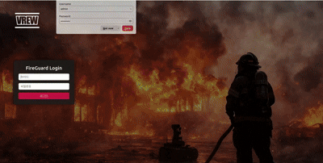
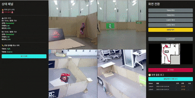

# SLAM기반 자율주행 로봇 시스템 프로젝트

 

## 🗂️ 목차

### 1. [프로젝트 개요](#-프로젝트-개요)

### 2. [동작 시나리오](#-동작-시나리오)

### 2. [팀 구성 및 역할](#-팀-구성-및-역할)

### 3. [사용 기술](#-사용-기술)

### 4. [System Architecture](#-System-Architecture)

### 5. [시연 영상](#-시연-영상)

### 6. [평가 및 피드백](#-평가-및-피드백)

 

## 📃 프로젝트 개요

### 화재 감지와 협동 로봇 (Fire Guard AMR)
실시간 화재 감지 및 골든타임 초기 조치를 통한 안전성 및 효율성을 제공하는 로봇.   
CCTV(webcam)를 통해 화재를 감지하고, 그 즉시 화재 대응 로봇(Robot A)이 해당 구역으로 출동,    
다른 로봇(Robot B)는 건물 내부의 사람들을 발견하면 경고 안내를 진행 후 대피소로 안내 업무 수행.

#### 📆 개발 기간 : 2025년 11월 24일 ~ 2025년 12월 05일

 

## 🎞️ 동작 시나리오

1. WebCam을 통해 화재 발생 감지
2. 모니터링 시스템에서 화재 경보 및 소방소 화재발생 신고
3. 화재 진압 로봇 (로봇 A), 대피 안내 로봇 (로봇 B) 출동
4. 모니터링 시스템에서 전달받은 구역으로 로봇 A 이동   
    4-1. 해당 구역으로 이동 후 화재 감지   
    4-2. 화재 감지 후 화재 진압 진행
5. 건물 내 지정된 구역으로 대피 안내 로봇 (로봇 B) 출동   
    5-1. 구역 순찰 진행   
    5-2. 순찰 중 사람 발견 시 사람에게 접근 후 경고 안내 진행   
    5-3. 지정된 대피소로 안내 진행   
    5-4. 안내 완료 후 다시 순찰 진행   
6. 화재 진압 완료 시 임무 종료 및 초기 위치로 복귀

 

## 🧑‍🤝‍🧑 팀 구성 및 역할

| 조원 | 역할 | 담당 업무 |
|:---------:|:-----------:|:--------:|
| 김효원, 김갑민 | 팀장, 팀원 | Custom map 생성, 웹캠 - DB - 모니터링 시스템 통합   로봇B 사람 Detect 및 Approach 기능 구현, 로봇B Patrol 기능 구현
| 강동혁, 김정욱 | 팀원, 팀원 | 실제 환경 구성 및 SlAM 기반 지도 생성, 로봇 참조 프레임 구성 및 원점 교정   YOLO 기반 Alert Sound 노드 패키지 개발, 동영상 편집|
| 김다빈, 이효원 | 팀원, 팀원 | YOLO fine tuning, Webcam 화재감지 구현   System Diagram 작성, 로봇A와 통합|
| 이용우, 황혜인 | 팀원, 팀원 | Flask 서버 구현, UI 디자인   DB로그 기록, UI를 활용한 시스템 통합 |

 

## 🕹️ 사용 기술

| 항목 | 내용|
|:------:|:-----------:|
|운영 체제|Ubuntu 22.04 LTS|
| ROS | ROS 2 Humble |
| 인식 모델 | YOLOv8n |
| 자율 주행 | Slam, Nav2, Rviz2 |
| 개발 언어 | Python 3.10.12 |
| 프레임워크 | OpenCV, ROS2 bridge, tf2_ros, ultralytics |

 

## 📝 System Architecture

 

## 🎥 시연 영상

 

## 🛠️ 평가 및 피드백

### 완성도 평가
- 계획했던 핵심 기능 (화재 감지 - 로봇 대응 - 모니터링) 구현
- 일부 최적화 및 안정화 과정 부족했지만, 전체 시스템의 흐름을 완성도 있게 구성

### 추후 개선점 및 보완할 점
- 화재 감지 및 사람 감지 알고리즘 정확도 향상 (조명 반사, 오탐 개선)
- 시스템 전체를 자동화된 테스트 환경에서 반복적으로 검증할 수 있는 구조 추가 

### 우리 팀이 잘한 부분 / 아쉬운 점
- 체계적인 역할 분담 & 각자 맡은 기능을 끝까지 책임지고 구현
- 모르는 부분은 적극적으로 질문하고 협력
- 장비의 반복적인 오류로 인해 개발 일정이 지연

### 느낌 점 및 경험한 성과
- YOLO 기반 화재 감지, ROS2 DDS 통신을 실제 로봇과 연동하며, 실시간 이벤트 기반 협동 시스템 구축 과정을 경험
- Nav2 경로 계획·SLAM·TF 구조를 다루며 다중 로봇의 자율주행 파이프라인과 로봇 시스템 아키텍쳐 흐름을 체계적으로 이해

